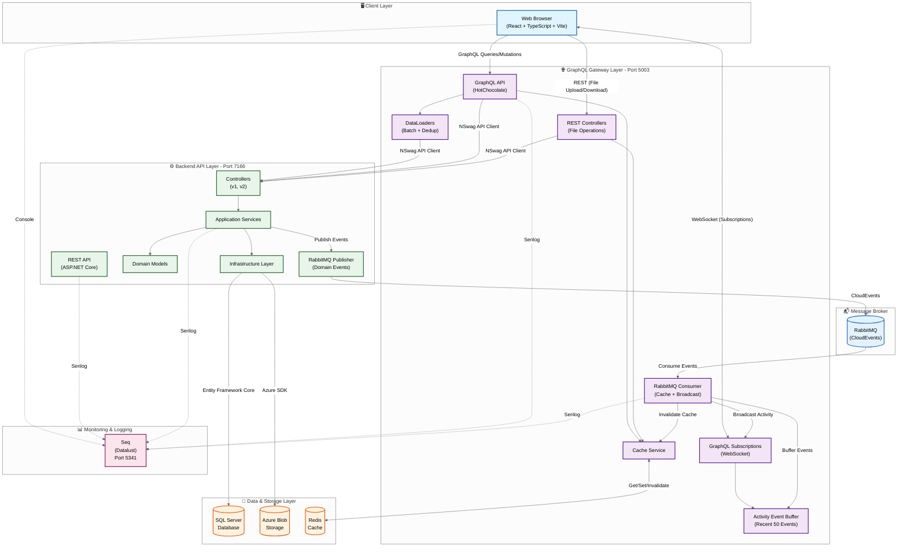
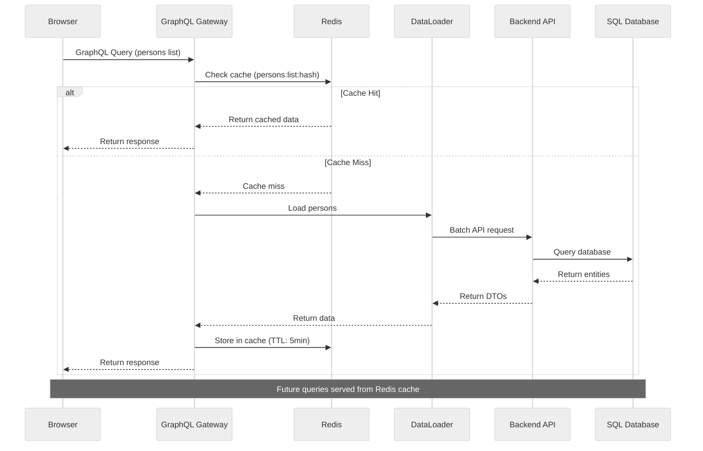
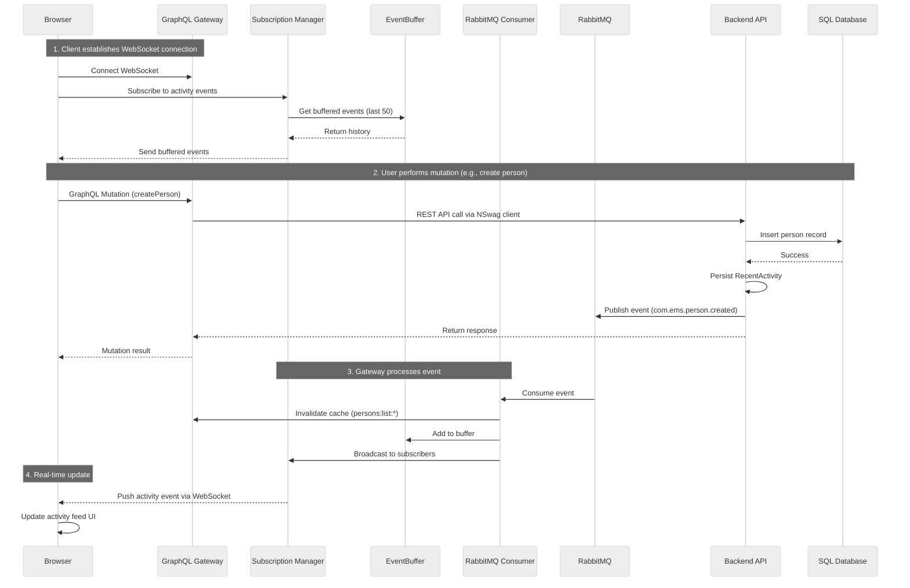
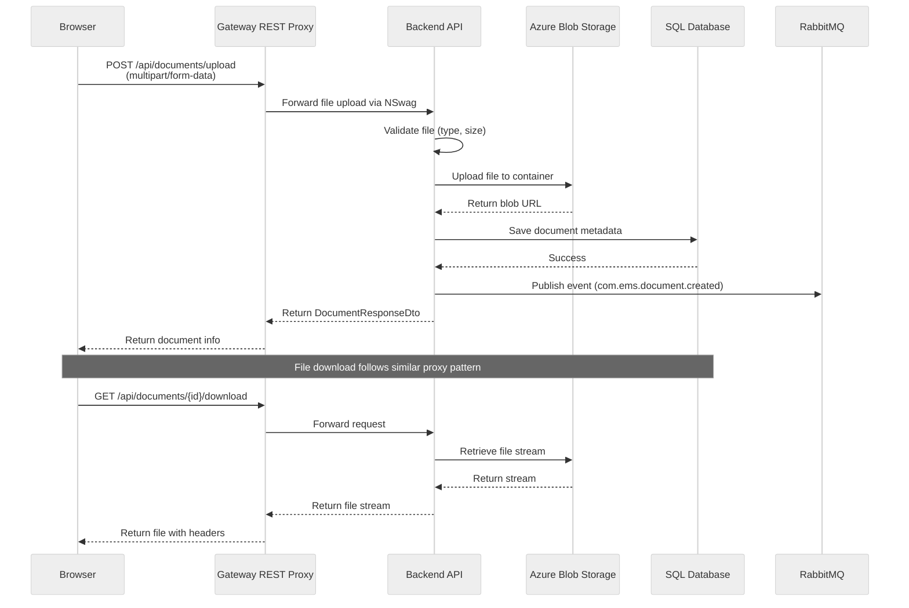

# Employee Management System

A comprehensive full-stack application for managing employees, persons, schools, and related records.

## Project Structure

```
ems-v2/
├── server/                                          # Backend API (ASP.NET Core with Clean Architecture)
│   ├── EmployeeManagementSystem.Domain/             # Entities and domain logic
│   ├── EmployeeManagementSystem.Application/        # Business logic and DTOs
│   ├── EmployeeManagementSystem.Infrastructure/     # Data access, external services, RabbitMQ publisher
│   │   └── Messaging/RabbitMQ/                      # RabbitMQ event publisher (Producer)
│   ├── EmployeeManagementSystem.Api/                # API controllers (v1)
│   ├── EmployeeManagementSystem.ApiClient/          # NSwag-generated API client for Gateway
│   ├── scripts/                                     # SQL scripts and setup scripts
│   │   ├── create-database.sql                      # Database creation script
│   │   ├── seed-data.sql                            # Mock data seed script (5,000 persons)
│   │   └── setup-rabbitmq-queues.ps1                # RabbitMQ setup script
│   └── tests/                                       # Unit and integration tests
├── gateway/                                         # GraphQL Gateway (HotChocolate)
│   └── EmployeeManagementSystem.Gateway/            # GraphQL types, queries, mutations
│       ├── Types/                                   # Query.cs, Mutation.cs
│       ├── Controllers/                             # REST proxy for file operations
│       ├── Caching/                                 # Redis caching
│       ├── Messaging/                               # RabbitMQ event consumer (Consumer)
│       └── DataLoaders/                             # HotChocolate DataLoaders
├── application/                                     # Frontend Application (React/TypeScript/Vite)
│   └── src/
│       ├── graphql/                                 # GraphQL operations and generated types
│       ├── components/                              # Reusable UI components
│       ├── contexts/                                # React context providers
│       ├── hooks/                                   # Custom React hooks
│       ├── pages/                                   # Page components
│       └── theme/                                   # Chakra-UI theme configuration
├── docs/                                            # Documentation
│   ├── server/                                      # Backend documentation
│   └── application/                                 # Frontend documentation
└── .github/                                         # GitHub configuration and copilot instructions
```

## Technology Stack

### Backend (.NET 10)
- **ASP.NET Core 10.0** - Web API framework
- **Clean Architecture** - Layered approach with strict separation of concerns
- **Entity Framework Core 10.0** - ORM for SQL database
- **Azure Blob Storage** - File storage for documents
- **JWT Authentication** - Secure API authentication with refresh token rotation
- **AspNetCoreRateLimit** - Rate limiting for API protection
- **RabbitMQ** - Event publishing (Producer) for domain events
- **Serilog + Seq** - Structured logging and centralized monitoring
- **Swagger/OpenAPI** - API documentation
- **xUnit** - Testing framework

### GraphQL Gateway (.NET 10)
- **HotChocolate 15** - GraphQL server for .NET
- **Redis** - Caching layer with hash-based key generation
- **RabbitMQ** - Event consumption (Consumer) for cache invalidation
- **GraphQL Subscriptions** - WebSocket support for real-time updates
- **Serilog + Seq** - Structured logging and centralized monitoring

### Frontend (React 19)
- **React** - UI framework
- **TypeScript** - Static typing
- **Vite** - Build tool
- **Chakra-UI** - Component library
- **AG Grid** - Data grid component
- **TanStack Query** - Server state management and data fetching
- **graphql-request** - Lightweight GraphQL client
- **graphql-ws** - WebSocket client for GraphQL subscriptions
- **GraphQL Code Generator** - Auto-generated types and documents
- **React Router** - Client-side routing

## Features

- **Person Management** - Create, update, and manage person records with profile images
- **Employment Tracking** - Track employment history, school assignments, and status
- **Position Management** - Define and manage job positions
- **Salary Grades** - Configure salary grade structures
- **School Management** - Manage educational institutions with addresses and contacts
- **Document Storage** - Upload and manage documents with Azure Blob Storage
- **Item Inventory** - Track items and inventory
- **Real-time Activity Feed** - Live updates via GraphQL subscriptions (WebSocket)
- **Reports** - Generate various reports
- **Authentication** - Secure login with JWT tokens and HttpOnly cookies for refresh tokens
- **Toast Notifications** - Centralized notification system with automatic error handling
- **Structured Logging** - Serilog with Seq for centralized monitoring

## Getting Started

**📚 New to the project? See the [Quick Start Guide](docs/QUICK-START.md) for detailed step-by-step setup instructions.**

### Prerequisites
- .NET 10 SDK
- Node.js 18+ and npm
- SQL Server (LocalDB or SQL Server Express)
- Azure Storage Account (for blob storage)
- Docker (for Redis, Seq, and RabbitMQ) or installed locally

### Backend Setup

```bash
cd server
dotnet restore
dotnet build
cd EmployeeManagementSystem.Api
dotnet run
```

The API will be available at `https://localhost:7166` with Swagger UI at `https://localhost:7166/swagger`

### Gateway Setup

First, ensure Redis, Seq, and RabbitMQ are running:
```bash
# Redis for caching
docker run -d --name redis -p 6379:6379 redis

# Seq for centralized logging
docker run -d --name seq -e ACCEPT_EULA=Y -p 5341:80 datalust/seq:latest

# RabbitMQ for event messaging
docker run -d --name rabbitmq -p 5672:5672 -p 15672:15672 rabbitmq:management
```

Then start the Gateway:
```bash
cd gateway/EmployeeManagementSystem.Gateway
dotnet run
```

The GraphQL Gateway will be available at `https://localhost:5003/graphql`

Access Seq UI for logs: `http://localhost:5341`
Access RabbitMQ Management UI: `http://localhost:15672`

### Frontend Setup

Create a `.env` file from the template:
```bash
cd application
cp .env.example .env
# Edit .env with your Google OAuth Client ID
```

Install dependencies and start:
```bash
npm install
npm run dev
```

The application will be available at `http://localhost:5173`

### Generate GraphQL Types

After changes to the GraphQL schema, regenerate the frontend types:

```bash
cd application
npm run codegen
```

## Architecture

The system uses a three-tier architecture with GraphQL Gateway and **real-time subscriptions**:
- **Frontend** communicates with the **GraphQL Gateway** (HotChocolate) for queries, mutations, and subscriptions
- **Frontend** uses Gateway **REST endpoints** for file upload/download operations
- **Frontend** receives **real-time activity updates** via GraphQL subscriptions over WebSocket
- **Gateway** uses the **NSwag-generated API client** to communicate with the Backend
- **Backend** handles business logic, data persistence, and file storage
- **Backend** publishes domain events to **RabbitMQ** (Producer)
- **Gateway** consumes events from **RabbitMQ** to invalidate cache and broadcast to subscribers

```
┌─────────────────────────────────────────────────────────────────────┐
│                         Frontend (React)                            │
│    TanStack Query + graphql-request + graphql-ws + REST fetch       │
└─────────────────────────────────────────────────────────────────────┘
           │                    │                       │
           │ GraphQL            │ WebSocket             │ REST (files)
           │ (Query/Mutation)   │ (Subscriptions)       │
           ▼                    ▼                       ▼
┌──────────────────────────────────────────────────────────────────────┐
│                     Gateway (HotChocolate)                           │
│  ┌───────────────────────────┐    ┌───────────────────────────────┐  │
│  │  GraphQL (Query/Mutation) │    │  REST Controllers (Documents) │  │
│  │  + Subscriptions (WS)     │    │                               │  │
│  └───────────────────────────┘    └───────────────────────────────┘  │
│               │ Uses NSwag ApiClient             │                   │
│  ┌───────────────────────────────────────────────────────────────┐   │
│  │  RabbitMQ Consumer (Cache Invalidation + Subscription Pub)    │   │
│  └───────────────────────────────────────────────────────────────┘   │
└──────────────────────────────────────────────────────────────────────┘
                │                                  ▲
                ▼                                  │ Events
┌─────────────────────────────────────────────────────────────────────┐
│                      Backend API (ASP.NET Core)                     │
│           Controllers → Services → EF Core → SQL Database           │
│                      ↓           └──→ Azure Blob Storage            │
│           RabbitMQ Producer (Domain Events)                         │
└─────────────────────────────────────────────────────────────────────┘
```

### Detailed Architecture Flow



### Sequence Diagrams

#### 1. GraphQL Query Flow (with Caching)



#### 2. Event-Driven Update Flow (Real-time)



#### 3. File Upload Flow



**Key Components:**
- **RabbitMQ**: Event messaging using CloudEvents format for decoupled communication between Backend and Gateway
- **Event Publisher (Backend)**: Publishes domain events (person.created, person.updated, etc.) after data mutations
- **Event Consumer (Gateway)**: Listens for domain events, invalidates cache, and broadcasts to subscribed clients
- **GraphQL Subscriptions**: WebSocket-based real-time updates for activity feed and notifications
- **Activity Event Buffer**: In-memory circular buffer (50 events) for new subscription clients to receive recent history
- **Redis Cache**: Used by the Gateway for caching GraphQL queries and responses with hash-based key generation
- **Seq (Datalust)**: Centralized logging platform for structured logs from all layers (accessible at `http://localhost:5341`)
- **SQL Server**: Primary database for persisting entities using Entity Framework Core
- **Azure Blob Storage**: File storage for documents, profile images, and other binary content
- **DataLoaders**: Prevent N+1 query problems by batching and deduplicating requests to the Backend API

## API Standards

### REST API (Backend)
- **Lowercase URLs** - All API routes use lowercase (e.g., `/api/v1/persons`, `/api/v1/salarygrades`)
- **Versioning** - URL-based versioning (currently v1)
- **Secure Authentication** - JWT access tokens (15 min) with HttpOnly cookies for refresh tokens (7 days)
- **Token Rotation** - Automatic refresh token rotation with reuse detection
- **Rate Limiting** - Configurable rate limits (5 auth requests/min in production)
- **OpenAPI/Swagger** - Interactive API documentation at `/swagger`

### GraphQL (Gateway)
- **Type-safe** - Strongly typed schema
- **Single endpoint** - All queries/mutations via `/graphql`
- **Redis Caching** - Hash-based key generation for accurate cache invalidation
- **DataLoaders** - Prevents N+1 query problems

## Project Guidelines

See [.github/copilot-instructions.md](.github/copilot-instructions.md) for detailed coding standards and guidelines.

## Documentation

### Quick Links
- [**Changelog**](CHANGELOG.md) - Recent changes and updates

### Architecture & Development
- [Frontend Documentation](docs/application/README.md)
- [Backend Documentation](server/README.md)
- [Frontend Development Guide](docs/application/DEVELOPMENT.md)
- [Backend Development Guide](docs/server/DEVELOPMENT.md)

### Security & Deployment
- [Security Guide](docs/SECURITY.md) - Authentication, vulnerabilities, best practices
- [Deployment Guide](docs/DEPLOYMENT.md) - Azure deployment instructions
- [Implementation Summary](docs/IMPLEMENTATION-SUMMARY.md) - Recent security fixes

### Technical Details
- [Analysis Summary](docs/ANALYSIS-SUMMARY.md) - Architecture analysis and improvements
- [API Reference](docs/server/API-REFERENCE.md) - Complete API endpoint documentation
- [Database Schema](docs/server/DATABASE.md) - Database structure and relationships
- [GraphQL Quick Reference](docs/server/GRAPHQL-QUICK-REFERENCE.md) - GraphQL schema
- [Logging & Monitoring](docs/server/LOGGING.md) - Serilog and Seq logging implementation

## License

This project is licensed under the MIT License - see the [LICENSE](LICENSE) file for details.
